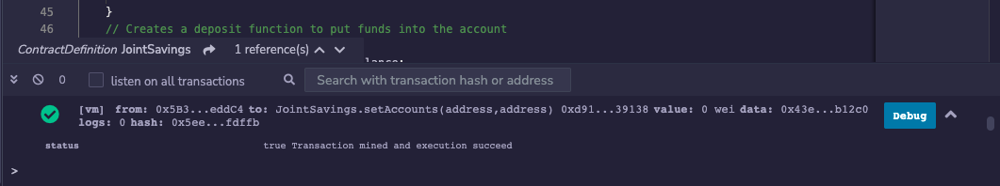
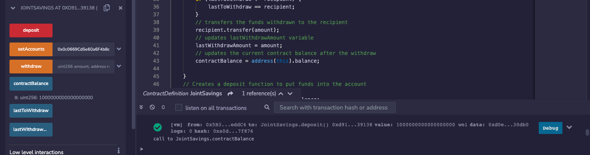
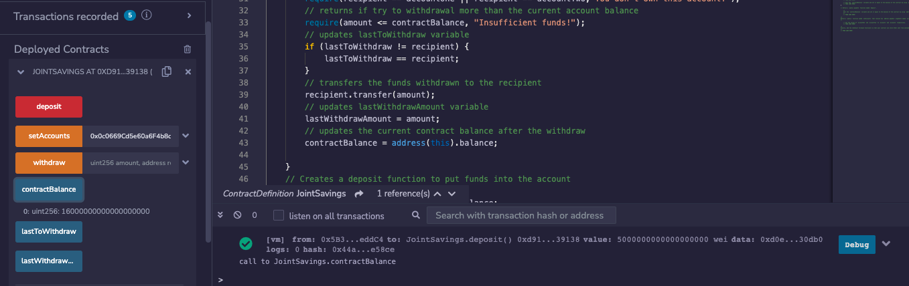
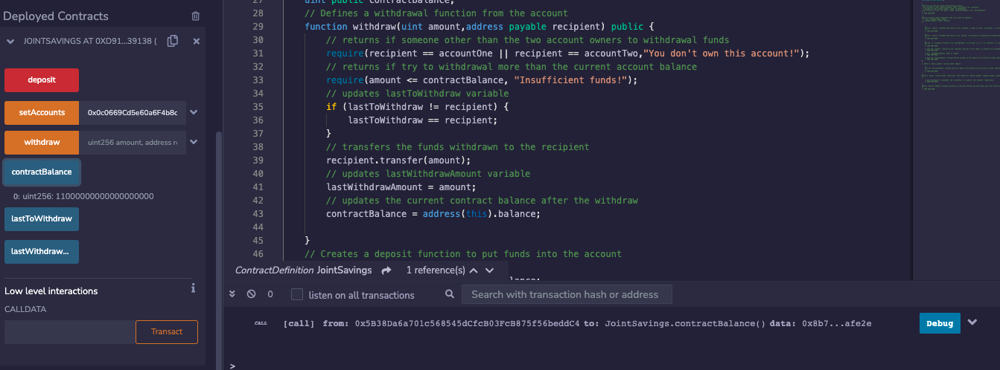
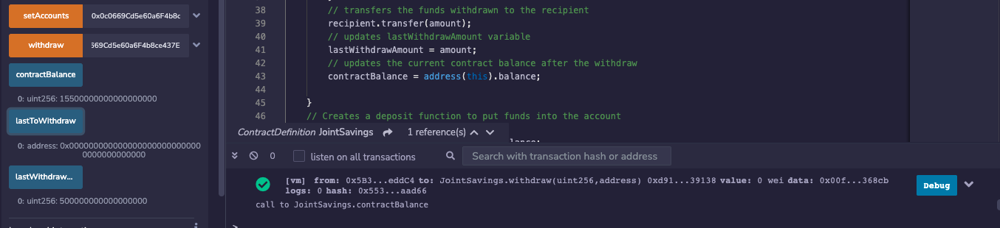
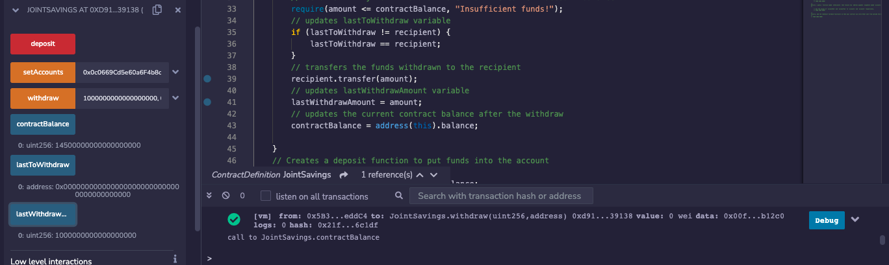

# Blockchain_Joint_Savings_Transactions

This application is used to create a joint savings account between two addresses that are both able to withdraw and deposit funds in Wei.

---

## Technologies

This application is written in Solidity 0.5.0 and is deployed on the Javascript VM on the [Remix IDE](https://remix.ethereum.org/).

---

## Installation Guide

Prior to running this application, naviagte to the website for Remix IDE where the code is deployed at https://remix.ethereum.org/

---

## Usage

In order to launch the application, navigate to the Blockchain_Joint_Savings_Transactions folder that contains all of the code for this application, and then open the joint_savings_1.sol file in the Remix IDE:

Once the file is open in the Remix IDE, navigate to the'compiler' tab and make sure the compiler is set to 0.5.0, and then compile the joint_savings_1.sol file. Next, navigate to the 'Deploy and Run Transactions tab' and click deploy to deploy the application. Once deployed, naviagte to the deployed contracts section to interact with the various funcionalities of the application such as deposit, setAccounts, and withdraw. 

Below, you can see examples of one of these functionalities and the resulting account balance being viewed: 
Set Accounts:

Ether Deposits:

Ether Withdraws:

---

## Contributors

Robby Odum

Email: rodum012@gmail.com

---

## License

MIT
